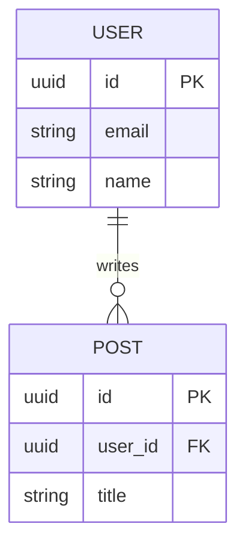

# STEP 2: 개발 문서 작성 프롬프트

> **사용 방법**: `blueprint.md`가 완성된 후 사용하세요.
> 아래 프롬프트를 Claude Code에 붙여넣으세요.

---

## 프롬프트

```
당신은 시니어 소프트웨어 아키텍트입니다.
아래 청사진을 기반으로 구체적인 개발 문서(dev-spec.md)를 작성해주세요.

## 청사진

{blueprint.md 내용을 여기에 붙여넣기}

## 작업

청사진을 분석하여 아래 형식의 개발 문서를 작성하세요.
파일 경로: workspaces/[service-name]/planning/in-progress/dev-spec.md

개발 문서 작성 시 다음을 최우선으로 고려하세요:
1. **병렬 작업 가능성**: 여러 AI Agent 또는 개발자가 동시에 작업 가능한 구조
2. **낮은 결합도**: 각 모듈이 다른 모듈의 내부 구현에 의존하지 않도록
3. **명확한 인터페이스**: 모듈 간 통신 방법(API, 이벤트, 공유 타입)을 먼저 확정

---

## 출력 형식 (dev-spec.md)

# 개발 문서: [PROJECT_NAME]

> **참조**: blueprint.md
> **작성일**: YYYY-MM-DD
> **버전**: 1.0

---

## 1. 아키텍처 결정

### 채택한 아키텍처 패턴
(선택한 패턴과 선택 이유)

### 주요 아키텍처 결정 사항 (ADR)
| 결정 | 선택지 | 선택 이유 |
|-----|--------|---------|
| 인증 방식 | JWT vs Session | ... |
| DB 선택 | PostgreSQL vs MySQL | ... |

---

## 2. 시스템 구성요소

### 서비스/모듈 목록

각 구성요소는 **독립적으로 개발 가능**해야 합니다.

```
[서비스명]
├── [모듈/서비스 1] - 담당 책임
├── [모듈/서비스 2] - 담당 책임
└── [모듈/서비스 3] - 담당 책임
```

### 구성요소별 상세 설명

#### [모듈/서비스 1]
- **책임 범위**: (이 모듈이 하는 일과 하지 않는 일)
- **외부 의존**: (다른 모듈과의 통신이 있다면, 어떤 계약으로)
- **기술 스택**:
- **예상 파일 수**: (대략적인 규모)
- **독립 작업 가능 여부**: ✅ 가능 / ⚠️ [선행 필요]

#### [모듈/서비스 2]
...

---

## 3. 공유 인터페이스 (먼저 확정)

> **중요**: 병렬 개발을 위해 이 섹션을 가장 먼저 확정해야 합니다.
> 각 Agent는 이 계약을 따라야 합니다.

### 3-1. API 엔드포인트 목록

| Method | Path | 담당 모듈 | 설명 |
|--------|------|---------|------|
| POST | /api/v1/auth/login | auth | 로그인 |
| GET | /api/v1/users/:id | member | 사용자 조회 |

### 3-2. 이벤트/메시지 계약

(Kafka, RabbitMQ, 또는 내부 이벤트를 사용하는 경우)

| 이벤트명 | 발행자 | 소비자 | 페이로드 |
|---------|--------|--------|---------|
| user.created | auth | member, notification | `{ userId, email }` |

### 3-3. 공유 타입/모델

```typescript
// 또는 Java DTO, Python dataclass 등 해당 언어로
interface User {
  id: string;
  email: string;
  // ...
}
```

### 3-4. 에러 코드 체계

| 범위 | 모듈 | 예시 |
|-----|------|------|
| 1000-1999 | 공통 | 1000: 유효하지 않은 요청 |
| 2000-2999 | 인증 | 2001: 토큰 만료 |

---

## 4. 데이터 모델

### ERD 개요

(텍스트 형식 또는 Mermaid)



### 테이블 상세

#### [테이블명]
| 컬럼명 | 타입 | 제약 | 설명 |
|-------|------|------|------|
| id | UUID | PK | |
| created_at | TIMESTAMP | NOT NULL | |

---

## 5. 기술 스택 (확정)

| 레이어 | 기술 | 버전 | 선택 이유 |
|-------|------|------|---------|
| Frontend | React | 18.x | ... |
| Backend | Spring Boot | 3.x | ... |
| Database | PostgreSQL | 16.x | ... |
| Cache | Redis | 7.x | ... |
| Message Queue | Kafka | 3.x | ... |
| Infra | AWS ECS | - | ... |

---

## 6. 비기능 요구사항

### 성능
- API 응답 시간: p99 < 500ms
- 동시 접속자: 최대 1,000명

### 보안
- 인증: JWT (access 30분, refresh 7일)
- 민감 데이터 암호화: BCrypt (비밀번호)
- CORS: 허용 도메인 명시

### 가용성
- 목표 SLA: 99.9%
- 장애 복구 목표: RTO < 30분, RPO < 1시간

---

## 7. 개발 단계 (순서)

> 각 단계는 병렬 작업 가능 여부를 명시합니다.

### Phase 0: 공유 기반 (직렬 - 먼저 완료 필요)
- [ ] 공유 타입/모델 정의
- [ ] DB 스키마 마이그레이션 파일
- [ ] 환경 설정 (Docker, CI/CD 초안)

### Phase 1: 독립 모듈 개발 (병렬 가능 ✅)
- [ ] **Agent 1**: [모듈 A] 구현
- [ ] **Agent 2**: [모듈 B] 구현
- [ ] **Agent 3**: [모듈 C] 구현

### Phase 2: 의존 모듈 개발 (Phase 1 완료 후)
- [ ] [모듈 D] (A에 의존)
- [ ] [모듈 E] (B에 의존)

### Phase 3: 통합 및 테스트
- [ ] 통합 테스트
- [ ] E2E 테스트

---

## 8. 병렬 작업 분리 계획

> 이 섹션이 핵심입니다. 각 Agent의 작업 영역이 겹치면 안 됩니다.

### 작업 경계 정의

| Agent | 담당 영역 | 작업 파일 경로 | 공유 파일 (읽기만) |
|-------|---------|--------------|----------------|
| Agent 1 | 인증 모듈 | `src/auth/**` | `src/shared/types.ts` |
| Agent 2 | 게시글 모듈 | `src/post/**` | `src/shared/types.ts` |
| Agent 3 | 프론트엔드 | `frontend/**` | `src/shared/api-contract.json` |

### 충돌 방지 규칙
1. 각 Agent는 자신의 담당 경로 **외부 파일을 수정하지 않는다**
2. 공유 파일(types, constants)은 Phase 0에서 완성 후 **읽기 전용**
3. 통합이 필요한 파일(`app.ts`, `router.ts` 등)은 Phase 3에서 한 번에 처리

### git worktree 전략 (선택 시)
```bash
# 각 Agent가 별도 브랜치/worktree에서 작업
git worktree add ../worktree/agent-auth feature/auth-module
git worktree add ../worktree/agent-post feature/post-module
git worktree add ../worktree/agent-frontend feature/frontend

# 완료 후 순서대로 merge
git merge feature/auth-module   # Phase 1 완료 후
git merge feature/post-module
git merge feature/frontend
```
```

개발 문서 작성 후 다음 사항을 반드시 확인하고 알려주세요:
1. 병렬로 작업 가능한 파트는 몇 개인지
2. 반드시 직렬로 처리해야 하는 선행 작업은 무엇인지
3. Agent 간 충돌이 발생할 가능성이 있는 지점
